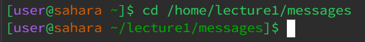

# Lab Report 1                          Kazuya Miyata 

**Working Directory: lecture1**  

> Because the command 'cd' moves the working directory to whatever is specified, leaving no arguments makes it default to the root directory or /home.
> There were no errors
---

