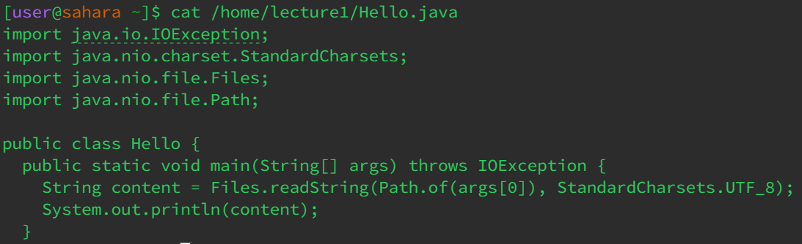

# Lab Report 1                          Kazuya Miyata 

## Using the cd command  

**Working Directory: /home/lecture1**  

>Because the command 'cd' moves the working directory to whatever is specified, leaving no arguments makes it default to the root directory or /home. There were no errors

  

**Working Directory: /home**  

> In this case I specified to cd to the directory where messages are stored so by putting the directory of messages as the argument the working directory is now /messages. There were no errors

  
**Working Directory: /home**  

>This attempt to cd to a java file resulted in an error because a file is not a directory and therefore it can not be made the working directory

## Using the ls command  

  
**Working Directory: /home/lecture1**  

> The ls command lists the files & folders of the specified directory. With no directory specified it defaults to listing the files of the current working directory which is /home/lecture1There were no errors

  

**Working Directory: /home/lecture1**    

> Because I specified the directory of /home/lecture1/messages, the command lists the contents of the provided argument. There were no errors

  
**Working Directory: /home/lecture1**  

> While not an error, because a file cannot have subdirectories/files the ls command just lists its path when specified a file instead of a directory. There were no errors

## Using the cat command  

  
**Working Directory: /home**    

> The command prompt bugs out as the lack of argument in the cat command creates an infinite prompt until terminated. 

  
**Working Directory: /home**    

> An error occurs as the cat command is used to list the contents of files and not directories. 

  
**Working Directory: /home**    

> By specifying the directory of the java file contained in /home/lecture1/Hello.java, the command outputs the contents of the java file.
> There are no errors 

