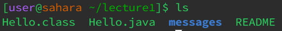

# Lab Report 1                          Kazuya Miyata 

**Working Directory: /home/lecture1**  

> Because the command 'cd' moves the working directory to whatever is specified, leaving no arguments makes it default to the root directory or /home.
> There were no errors
---
  

**Working Directory: /home**  

> In this case I specified to cd to the directory where messages are stored so by putting the directory of messages as the argument the working directory is now /messages. 
> There were no errors
---
  
**Working Directory: /home**  

>This attempt to cd to a java file resulted in an error because a file is not a directory and therefore it can not be made the working directory
---

