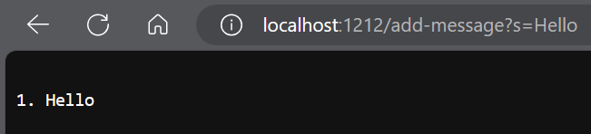
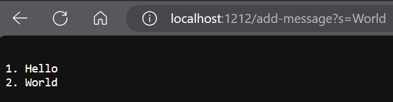

# Lab Report 2                          Kazuya Miyata

## String Server Implementation:  
```
import java.io.IOException;
import java.net.URI;

class Handler implements URLHandler {
    //Stores the Strings and the total number of Strings
    String output = "";
    int num = 0;

    public String handleRequest(URI url) {
        //Checks if path is valid
        if (url.getPath().equals("/add-message")) {
            //Creates String array to split parts of the query
             String[] parameters = url.getQuery().split("=");
                if (parameters[0].equals("s")) {
                    //If the format is correct, increment number of Strings and concatnate to output
                    num++;
                    output += "\n" + num + ". " + parameters[1];
                    //Returns the output 
                    return output;
                } else {
                    //If the format of the query is invalid
                    return "Invalid Format!";
                }


        } else { //Returns if path is invalid
            return "404 Not Found!";
        }
    }
}

class StringServer {
    public static void main(String[] args) throws IOException {
        if(args.length == 0){
            System.out.println("Missing port number! Try any number between 1024 to 49151");
            return;
        }

        int port = Integer.parseInt(args[0]);

        Server.start(port, new Handler());
    }
}
```

**Examples of the code Working**  
  
* handleRequest is the method that is called when it is called
* The method takes in a single URI as an argument which contains the url that is ran, which in this case is "http://localhost:1212/add-message?s=Hello"
* The String parameter would change to contain the 2 sides of the query separated by "=" which makes the value of the parameter array ["s", "Hello"]
* Because the taken URI argument is formatted correctly, the value of num is incremented from 0 to 1.
* For the same reason the string output is concatenated with the value of num and parameter[1] which contains the specified input, making its value "\n1. Hello"

  
* The same method handleRequest is called
* The method takes in a different URI as an argument which contains the url that is ran, which in this case is "http://localhost:1212/add-message?s=World"
* The String parameter would change to contain the 2 sides of the query separated by "=" which makes the value of the parameter array ["s", "World"]
* Because the taken URI argument is formatted correctly, the value of num is incremented from 1 to 2.
* For the same reason the string output is concatenated on top of the saved value with the value of num and parameter[1] which contains the specified input, making its value "\n1. Hello\n2. World"
